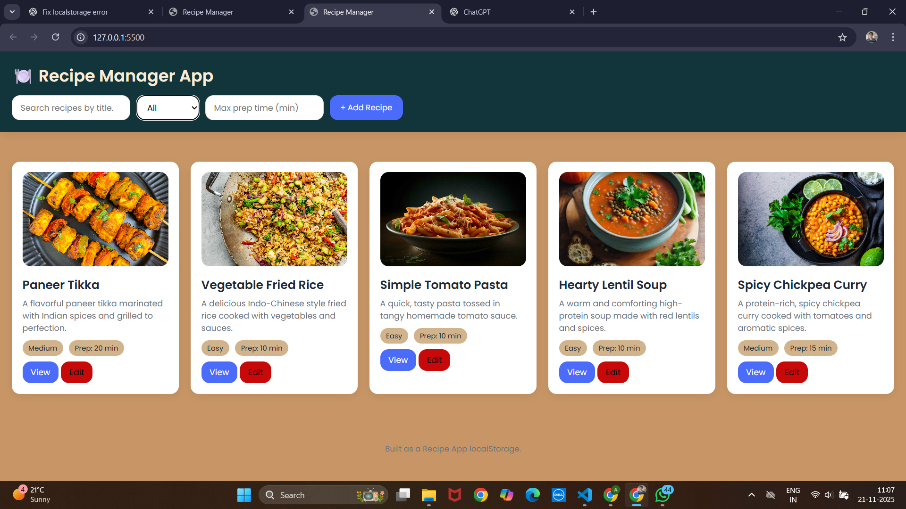
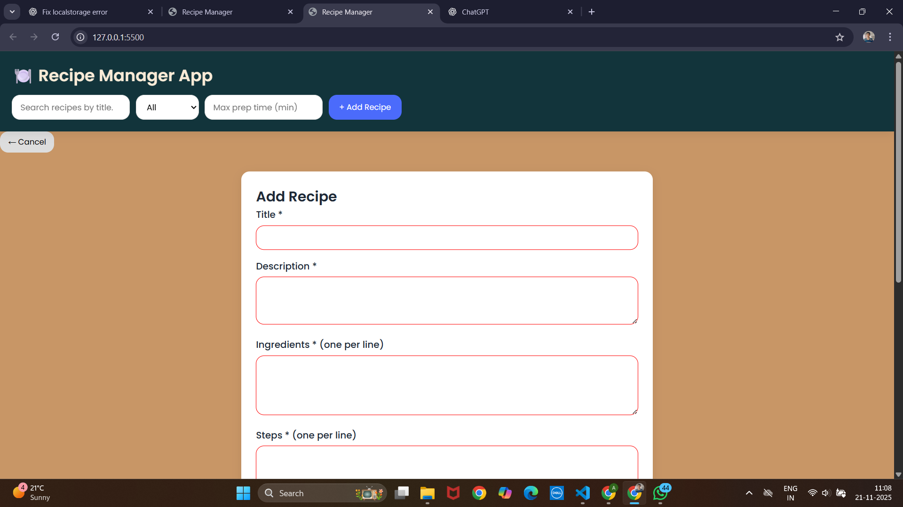
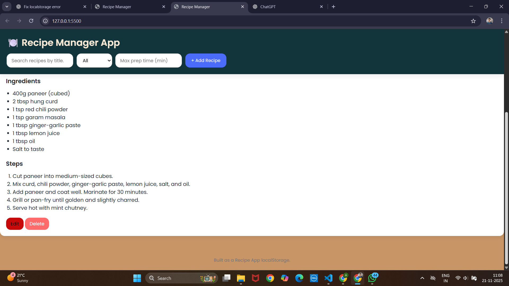

# 🍽️ Abhinav Recipe App

A responsive **Single Page Application (SPA)** built using **HTML, CSS, and Vanilla JavaScript**.  
The app allows users to **add, edit, delete, filter, and view recipes**, with all data stored in **localStorage**.

Live Website:  
👉 https://abhinavtiwari11.github.io/Abhinav-recipe/

---

## 📂 Source Code

GitHub Repository:  
👉 https://github.com/abhinavtiwari11/Abhinav-recipe.git

---

## ▶️ How to Run the App

### **Option 1 — Open Locally**
1. Download or clone the repository  
2. Open `index.html` in any modern browser  
3. The app runs instantly — no server required  

### **Option 2 — GitHub Pages**
Already hosted here:  
https://abhinavtiwari11.github.io/abhinav-recipe-app/

---

## 🗄️ Data Structure in localStorage

All recipes are stored in:

### Example Data Structure

[
  {
    "id": "r_abc123",
    "title": "Paneer Tikka",
    "description": "A flavorful paneer tikka marinated with Indian spices.",
    "ingredients": [
      "400g paneer",
      "2 tbsp hung curd"
    ],
    "steps": [
      "Cut paneer into cubes",
      "Prepare marinade",
      "Grill paneer"
    ],
    "prepTime": 20,
    "cookTime": 10,
    "difficulty": "Medium",
    "imageUrl": "https://some-image-url.jpg"
  }
]

Optional
🧠 Assumptions & Limitations
Assumptions

User enters valid text (no HTML injection protection added)

Browser supports ES6 and localStorage

User understands basic cooking terminology

Images are provided using URLs, not local uploads

Limitations

No backend → data only saved on user’s browser

Clearing browser storage resets the app

| Issue                  | Description                                 | Status             |
| ---------------------- | ------------------------------------------- | ------------------ |
| Image missing fallback | If image URL fails, blank area appears      | To be improved     |
| Mobile layout shift    | Keyboard covers input fields on some phones | Pending            |
| No pagination          | Large number of recipes may load slowly     | Future enhancement |
| No dark mode           | Only light theme currently                  | Optional add-on    |

## 👨‍💻 Author

Abhinav Tiwari

GitHub: https://github.com/abhinavtiwari11

Portfolio: https://abhinavtiwari11.github.io/portfolio

## 📷 SCREENSHOT 

### HOMEPAGE

### ADD 

### EDIT 

